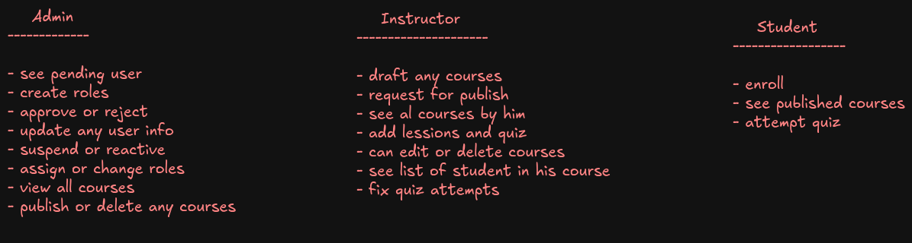
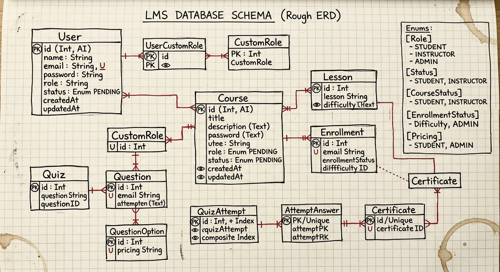

# Online Course Platform 

    Register → PENDING → Admin Approves → ACTIVE → Can use platform

    STUDENT    → Browse, Enroll, Learn, Quiz, Certificate
    INSTRUCTOR → Create Course → Submit → Admin Reviews → Published
    ADMIN      → Approve Users, Approve Courses, Manage Roles

## what each roles can do

 


## ER Diagram

 


## Frontend 
    - nextjs


##  Backend

A REST API for an online course and quiz platform built with
Node.js, Express, TypeScript, Prisma and MySQL.

---

###  Tech Stack

| Layer        | Technology              |
|--------------|-------------------------|
| Runtime      | Node.js                 |
| Framework    | Express.js              |
| Language     | TypeScript              |
| ORM          | Prisma                  |
| Database     | MySQL (aiven.io)     |
| Auth         | JWT (jsonwebtoken)      |
| Password     | bcryptjs                |

---

## 🚀 Setup & Installation

### 1. Clone the repository

```bash
git clone git@github.com:maruf-rahman007/online-course.git || git clone https://github.com/maruf-rahman007/online-course.git
cd online-course/backend


```
### 2. Install dependencies

```bash
npm install
```

### 3. Setup environment variables
Create a .env file in the root directory:

``` bash
DATABASE_URL="use your connection string"
JWT_SECRET="your_super_secret_jwt_key"
PORT=4001

```

### 4. Run database migrations

```bash

npx prisma migrate dev --name init

```

### 5. Generate Prisma client
```bash

npx prisma generate

```

### 6. Start development server
```bash

npm run dev

```